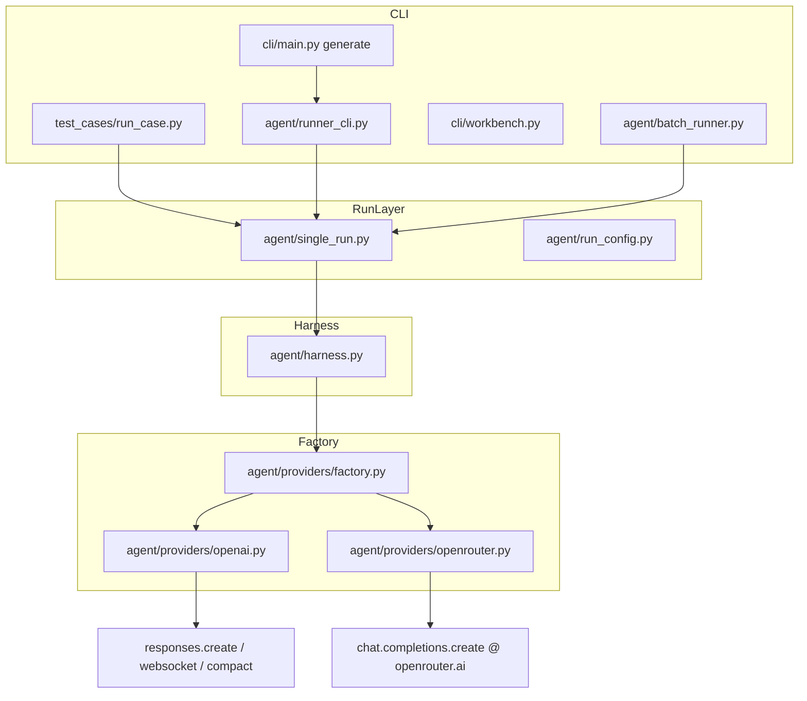
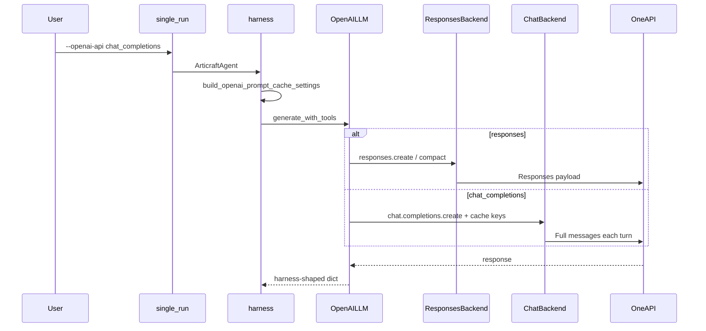

# OpenAI API Surface 改造规划

> **状态**：规划文档 v2（已修订，未实施）  
> **日期**：2026-07-09  
> **目标**：在保持 **Responses API 为默认** 的前提下，为 `--provider openai` 增加 **`--openai-api chat_completions`** 调用路径，缓解 OneAPI 等代理在 Responses + `gpt-5.4` 场景下的 **协议/参数兼容性问题**。  
> **参考实现**：`D:\code\assembly-agent-v2\.agents\skills\cad\scripts\_runtime\scripts\agent\`（CAD runtime 双 API surface 工厂）

---

## 修订摘要（v1 → v2）

| 主题 | v1 问题 | v2 修订 |
|------|---------|---------|
| 效果预期 | 默认 Chat 能「显著治好」504 | 拆成 **provider 稳定** vs **端到端 success**；504 可能仍存在 |
| Prompt Cache | 未写 | Chat 路径 **Phase 1 必须透传** `prompt_cache_key` |
| Reasoning | Chat 第一期完全不传 | 增加 **env 可配置矩阵**（`none` / `extra_body`） |
| `auto` surface | §5.3 与 Phase 4 矛盾 | **不做 `auto` 实现**；仅文档/env 推荐 |
| 观测字段 | 只提 `openai_api` | 同步 `openai_transport`；补 `cost.json` / `run_summary` 落点 |
| 文件清单 | ~75% | 补 `cost.py`、`external.py`、`test_provider_conformance` 等 |
| 类拆分 | >800 行再拆 | **Phase 1 即拆** `openai_chat_backend.py` |
| 验收标准 | 绑定 gpt-5.4 必 success | 降级为可观测改善 + 可归因失败类型 |
| 配置优先级 | 未定义 | CLI > `ARTICRAFT_*` > `OPENAI_*` > default |

---

## 1. 背景与动机

### 1.1 当前事实

| 维度 | Articraft 现状 |
|------|----------------|
| OpenAI 调用面 | **仅 Responses API**（`client.responses.create` / websocket / `responses.compact`） |
| 默认模型 | `gpt-5.5`（`agent/providers/openai.py`） |
| 默认 transport | `http`；可选 `websocket`（仅 Responses） |
| 代理场景 | `.env` 常见 `OPENAI_BASE_URL=https://oneapi-beta.qunhequnhe.com/v1` |
| 代理 edit 工具 | `openai_edit_mode.py` 在非官方 base URL 时自动切 `replace`/`write_file` |
| Chat Completions | **代码仅在 `openrouter` provider**；`--provider openai` **不走** Chat Completions |

`test_cases/run_case.py` 与 `articraft generate` 共用同一套 provider 栈，无独立 API key；benchmark 实际走 **OneAPI + `OPENAI_API_KEY`**。

### 1.2 观测到的问题（gpt-5.4 + OneAPI + Responses）

| 类型 | 表现 | 与 API surface 关系 | Chat 路径可能效果 |
|------|------|---------------------|-------------------|
| **连接/网关** | `Connection error`、nginx **504**（~3 min） | 长上下文、代理超时、重试耗尽 | **不确定**；全量 messages 可能更大；cache 失效会雪上加霜 |
| **参数不支持** | `Unsupported parameter: reasoning.summary` 等 400 | Responses 专有字段 | **较可能改善**（参数更少） |
| **增量/状态** | websocket `previous_response_id` 失效 | Responses 专有语义 | Chat 无此概念，**可能改善** |

`gpt-5.5` 在相同 case/图片下往往可跑通 → 不完全是建模问题，而是 **模型 × 代理 × API surface** 组合问题。

### 1.3 对 Chat Completions 收益的诚实预期

**Chat 路径主要解决**：代理对 Responses API 实现不完整（参数、tool 形态、状态机）。

**Chat 路径不保证解决**：

- 504 / 网关超时（上下文仍可能很大；且无 `responses.compact`）
- 生成质量（若 Chat 不传 reasoning effort，与 Responses + `thinking_level` 不等价）
- 成本（Responses 路径现有 run 大量 **prompt cache hit**；Chat cache 需在 OneAPI 上实测）

**验收应分两层**（见 §9）：

1. **Provider 稳定**：不再因 API 形态崩溃（400 参数、connection 立即失败等）
2. **端到端 success**：compile 通过、case 完成——**不作为 Phase 1 硬性要求**

### 1.4 为什么要加 Chat Completions（而不是换 provider）

- 用户已投入 OneAPI 与 `OPENAI_API_KEY`，不希望为 benchmark 单独接 OpenRouter。
- CAD runtime 已在同一 OneAPI 验证：**Responses 默认 + Chat Completions 显式兜底**。
- Articraft 内 `openrouter.py` 有成熟 Chat 逻辑可参考，但 **不能无脑整文件复用**（见 §5.10）。

---

## 2. 参考实现剖析（CAD runtime）

### 2.1 工厂切换

```
resolve_openai_api_surface()
        ↓
build_openai_provider(api_surface=...)
        ├─ "responses"          → OpenAIResponsesProvider  → responses.create
        └─ "chat_completions" → OpenAIChatProvider        → chat.completions.create
```

- CLI：`--openai-api chat_completions`
- Env：`OPENAI_API_SURFACE` / `CAD_OPENAI_API_SURFACE`（兼容别名）
- **不支持 `auto` 归一化值**（v2 决策：仅文档推荐，见 §13）

### 2.2 两条路径差异

| 能力 | Responses（CAD） | Chat Completions（CAD） |
|------|------------------|-------------------------|
| System prompt | `instructions` | `messages` 首条 `system` |
| 多模态 | codec → `input_text`/`input_image` | `image_url` / text parts |
| Tools | Responses shape（`strict`, custom） | 标准 `type: function` |
| Reasoning | `reasoning.effort` + `summary` | 默认不传 |
| Prompt cache | 支持 | **支持**（`prompt_cache_key` 传入 chat.create） |
| Compaction | 本地 tail compaction | 无 |
| Transport | 同步 HTTP | 同步 HTTP |
| Retry | 仅 `reasoning.summary` strip | 极少 |

### 2.3 对 Articraft 的启示

1. 工厂 + 归一化函数是正确边界。
2. Chat 路径刻意做减法：无 websocket、`responses.compact`、`previous_response_id`。
3. Harness 保持统一消息格式；转换在 provider 内部。
4. Chat 与 function edit tools 是自然搭配；**禁止** `apply_patch` custom tool。
5. **CAD Chat 仍传 prompt_cache_key**——Articraft 不能漏。

---

## 3. Articraft 现状架构



### 3.1 Provider 契约（不可破坏）

```python
build_request_preview(system_prompt, messages, tools) -> dict
prepare_next_request(...) -> PrepareRequestResult   # Chat: no-op
generate_with_tools(system_prompt, messages, tools) -> dict
context_window_pressure(usage) -> ContextWindowPressure  # Chat: 必须保留
close() -> None
```

`generate_with_tools` 返回 harness 形状：

```python
{
    "content": str,
    "tool_calls": list[dict],
    "thought_summary": str | None,
    "usage": dict | None,          # prompt_tokens, candidates_tokens, total_tokens, cached_tokens
    "extra_content": dict | None,  # OpenRouter 专用；OpenAI Chat 通常为空
}
```

`harness_codec.py` **无需修改**；provider 内部负责转换。

### 3.2 Responses 专有状态（Chat 必须隔离）

- `_input_items`、`_previous_response_id`、websocket 增量状态
- `responses.compact` / `responses.input_tokens.count`
- `_append_new_inputs` 中 **跳过 harness assistant 消息**（防重复）

Chat 路径：**每轮全量转换 `messages`**，不可跳过 assistant 历史。

### 3.3 Responses 路径的隐性优势（Chat 会失去的）

以 `01_articulated_desk_lamp` 成功 run 为例：`cost.json` 中 **cached_tokens ≈ 802816**，说明 Responses + `prompt_cache_key` 对长 benchmark 至关重要。Chat 路径若失去 cache，可能更慢、更贵、更易 504。

### 3.4 可复用资产与边界

| 模块 | 可复用 | 注意 |
|------|--------|------|
| `openrouter.py` | message/tool 转换、retry、response 解析 | 去掉 OpenRouter headers、`extra_body.reasoning` 默认值 |
| `openai_codec.py` | **仅 Responses** | 不混入 Chat |
| `openai_edit_mode.py` | 代理检测 | Chat 模式强制 function tools |
| `harness.build_openai_prompt_cache_settings` | cache key 生成 | Chat backend 必须消费 |

---

## 4. 目标与非目标

### 4.1 目标

1. **默认不变**：`--openai-api responses`（或不传）行为与今日一致。
2. **显式切换**：`--openai-api chat_completions` → `chat.completions.create` @ `OPENAI_BASE_URL`。
3. **配置可追溯**：`run_summary` / `cost.json` / provenance 记录 `openai_api` + `openai_transport`。
4. **CLI 全覆盖**（分阶段）：benchmark 与 generate 最终均可指定。
5. **测试可证明**：mock 单测 + 可选 OneAPI smoke；双 surface conformance。

### 4.2 非目标

- 不为 Gemini / Anthropic 增加 API surface。
- Chat 模式不实现 `responses.compact`（第一期）；本地 compaction 为 Phase 2/3 可选项。
- Chat 模式不实现 websocket。
- 不修改 SDK / compile / viewer 核心行为（viewer 展示 API surface 为可选）。
- 不自动迁移历史 run。
- **不实现 `openai_api=auto`**（见 §13）。

---

## 5. 技术方案

### 5.1 总体设计：门面 + 双 Backend（Phase 1 即拆分）

```
OpenAILLM(api_surface=..., transport=..., ...)
  ├─ OpenAIResponsesBackend   # 现有 openai.py 逻辑迁出或内部分模块
  └─ OpenAIChatBackend        # 新文件，Phase 1 创建
```

`factory.create_provider_client` 仍构造 `OpenAILLM`；`ProviderConstructors.openai` 不变。

**v2 决策**：不在 `openai.py` 单文件堆 >800 行新代码；Phase 1 创建 `openai_chat_backend.py`。

### 5.2 模块布局

```
agent/providers/
  openai_api_surface.py        # 新建：归一化、校验、配置优先级
  openai.py                    # 门面：分派 + 共享构造（client、env、dry_run）
  openai_responses_backend.py  # 新建（Phase 1）：从 openai.py 迁出 Responses 逻辑
  openai_chat_backend.py       # 新建（Phase 1）：Chat Completions
  openai_chat_codec.py         # 新建（Phase 1 末或 Phase 3）：共享转换
  openai_codec.py              # 保持 Responses 专用
  openai_edit_mode.py          # 扩展：chat 模式强制 function tools
  openrouter.py                # Phase 3：改为 import openai_chat_codec
```

### 5.3 API Surface 归一化与配置优先级

```python
OpenAIApiSurface = Literal["responses", "chat_completions"]

# 解析优先级（高 → 低）：
# 1. CLI --openai-api
# 2. ARTICRAFT_OPENAI_API_SURFACE
# 3. OPENAI_API_SURFACE  / CAD_OPENAI_API_SURFACE（兼容别名）
# 4. 默认 "responses"

def normalize_openai_api_surface(value: str | None) -> OpenAIApiSurface:
    normalized = (value or "").strip().lower()
    if normalized in {"chat", "chat_completions", "completions", "chat-completions"}:
        return "chat_completions"
    if normalized in {"", "responses", "response"}:
        return "responses"
    raise ValueError(f"Unsupported openai_api surface: {value!r}")
    # 注意：不接受 "auto"
```

`resolve_openai_settings(cli_api, cli_transport)` 统一校验：

- `provider != openai` 且传入非默认 `openai_api` → **报错**
- `chat_completions` + `websocket` → **fail fast**（`ValueError`）
- `chat_completions` + `ARTICRAFT_OPENAI_FUNCTION_EDIT_TOOLS=custom` → **fail fast**

### 5.4 CLI 与配置

```text
--openai-api {responses,chat_completions}
  默认: responses
  仅 --provider openai 时有效

环境变量（CLI 未指定时）:
  ARTICRAFT_OPENAI_API_SURFACE=chat_completions
  OPENAI_API_SURFACE=chat_completions    # CAD 兼容别名
```

#### 与 `--openai-transport` 的约束

| openai_api | openai_transport | 行为 |
|------------|------------------|------|
| `responses` | `http` | ✅ 默认 |
| `responses` | `websocket` | ✅ 现有 |
| `chat_completions` | `http` | ✅ 唯一支持 |
| `chat_completions` | `websocket` | ❌ **启动时报错** |

#### 与 `openai_edit_mode` 的联动

| 条件 | edit 工具 |
|------|-----------|
| 官方 `api.openai.com` + `responses` | 可 `apply_patch`（custom） |
| 非官方 base URL + `responses` | function tools（今日 `auto`） |
| **`chat_completions`（任意 base URL）** | **必须** function tools |

实现：`build_tool_registry` 前断言；`apply_patch` 不得出现在 Chat surface 的 tool schemas 中。

### 5.5 Chat Completions 请求路径

#### 基本 payload

```python
payload = {
    "model": self.model_id,
    "messages": [
        {"role": "system", "content": system_prompt},
        *_convert_chat_messages(messages),
    ],
    "tools": _convert_tools_for_chat(tools),
    "tool_choice": "auto",
}
```

#### Prompt Cache（Phase 1 必做）

Harness 已通过 `build_openai_prompt_cache_settings` 设置 `llm.prompt_cache_key` / `prompt_cache_retention`。Chat backend **必须透传**：

```python
if self.prompt_cache_key:
    create_kwargs["prompt_cache_key"] = self.prompt_cache_key
    create_kwargs["prompt_cache_retention"] = self.prompt_cache_retention or "24h"
```

**Phase 1 验收**：OneAPI 上跑 1 个多轮 case，检查 `usage` 是否出现 cached tokens（字段名因代理而异，需做兼容解析）。若无 cache hit，在 trace 写 `prompt_cache_unverified` 事件。

#### Reasoning / thinking_level（可配置，非静默忽略）

| 模式 | Env | Chat payload |
|------|-----|--------------|
| `none`（默认） | 未设置 / `ARTICRAFT_OPENAI_CHAT_REASONING=none` | 不传 reasoning |
| `extra_body` | `ARTICRAFT_OPENAI_CHAT_REASONING=extra_body` | `extra_body={"reasoning": {effort, ...}}`（对齐 openrouter 映射） |

`thinking_level` → effort 映射复用 `articraft.values.provider_reasoning_level`。

**不传** Responses 专有 `reasoning.summary`；Chat 路径不做 summary strip-retry。

**文档说明**：Chat + `none` 时，`--thinking med/high` 对代理行为 **不保证** 与 Responses 等价。

#### 多模态

- harness：`input_text` / `input_image` / `image_path`
- chat：`text` + `image_url`（本地路径 → data URL）

**必测**：`test_cases` 带 `NN.png` 的 complex cases。

#### Tool 往返

Harness tool 消息：

```python
{"role": "tool", "tool_call_id": "...", "name": "...", "content": "..."}
```

Chat 路径：

- 保留 `tool` role
- assistant 历史带 `tool_calls`
- **不**采用 Responses 的 assistant-skip 逻辑

#### Tool schema

Chat 使用标准 function schema（**无** Responses `strict: true` 归一化）。`read_file` 等工具走宽松 parameters（与 openrouter `_convert_tools` 一致）。

### 5.6 `prepare_next_request` 与 Compaction

| 模式 | 行为 |
|------|------|
| Responses | 现有 `decide_compaction` + `responses.compact` |
| Chat | `return PrepareRequestResult()`（no-op） |

**TUI / trace**：Chat 模式写 `compaction_skipped` / `compaction_unavailable`，`reason=chat_completions_no_api_compaction`，避免用户以为 compaction 坏了。

`cost.json` 的 `maintenance_total` 在 Chat 模式下恒为 0 — **预期行为**。

#### 长对话风险与缓解路线图

| 阶段 | 缓解 |
|------|------|
| Phase 1 | `max_turns` / `max_cost_usd`；retry 504 |
| Phase 2/3 | 移植 CAD **本地 tail compaction**（剪旧 tool output / read_file） |
| 运维 | 文档建议复杂 case 优先 gpt-5.5 或降低 thinking |

### 5.7 Retry 与超时

Chat 路径复用/抽取共享 retry（来自 `openai.py` / `openrouter.py`）：

- `OPENAI_MAX_ATTEMPTS`（默认 4）、指数退避
- 重试状态码：`408, 409, 425, 429, 500, 502, 503, 504`
- 401 不重试
- `OPENAI_REQUEST_TIMEOUT_SECONDS`（默认 900s）

### 5.8 `context_window_pressure`

Chat backend 实现 `context_window_pressure`（可复用 openrouter 逻辑 + `OPENAI_CONTEXT_WINDOW_TOKENS` / 按 model 表）。Harness TUI 依赖此方法，不可省略。

### 5.9 `build_request_preview`

- Responses：`instructions` + `input` + `tools`
- Chat：`messages` + `tools` + `model`
- 根字段：`"openai_api": "..."` 、 `"openai_transport": "..."`

`tests/agent/test_provider_conformance.py` 新增 Chat 版 tool-chain preview 测试。

### 5.10 从 `openrouter.py` 抽取的边界

| 共享进 `openai_chat_codec.py` | OpenAI Chat 专用 | 留在 OpenRouter |
|------------------------------|------------------|-----------------|
| `_convert_chat_messages` | `OPENAI_BASE_URL` | `OPENROUTER_BASE_URL` |
| `_convert_tools` | `prompt_cache_key` | default headers |
| `_convert_message_content` / image | 无 `extra_content.openrouter` | `extra_body.reasoning` 默认 |
| `_async_retry` 模式 | usage 字段兼容 OneAPI | reasoning_details 展示 |

---

## 6. 全量改造清单

### 6.1 核心 Provider 层

| 文件 | 改动 |
|------|------|
| `agent/providers/openai_api_surface.py` | **新建** |
| `agent/providers/openai_responses_backend.py` | **新建**（Phase 1 从 openai.py 迁出） |
| `agent/providers/openai_chat_backend.py` | **新建** |
| `agent/providers/openai_chat_codec.py` | **新建**（Phase 1 末或 Phase 3） |
| `agent/providers/openai.py` | 门面 + 构造；委托双 backend |
| `agent/providers/factory.py` | `ProviderConfig.openai_api` |
| `agent/providers/openai_edit_mode.py` | 文档 + chat 强制 function 校验辅助 |

### 6.2 Harness / Run 层

| 文件 | 改动 |
|------|------|
| `agent/harness.py` | 透传 `openai_api`；Chat 时 trace compaction 说明 |
| `agent/single_run.py` | 全入口透传 |
| `agent/run_config.py` | `SingleRunSettings.openai_api` |
| `agent/run_context.py` | settings summary |
| `agent/payload_preview.py` | 透传 |
| `agent/record_persistence.py` | provenance |
| `agent/rerun.py` / `agent/edit.py` | 恢复；缺字段 → `responses` |
| `agent/batch_runner.py` | 继承 env `ARTICRAFT_OPENAI_API_SURFACE`；硬编码 transport 保持 http |
| `agent/models.py` | `PromptPreviewRequest` |
| `agent/cost.py` | cost 持久化结构增加 run settings 元数据（或写入路径旁路） |
| `agent/defaults.py` | 如有默认 openai 设置则对齐 |

### 6.3 Storage / Schema

| 文件 | 改动 |
|------|------|
| `storage/models.py` | `GenerationSettings.openai_api: str | None = None` |
| `scripts/persist_staging_run.py` | 读取新字段 |

旧 record 无 `openai_api` → rerun 默认 `responses`。

### 6.4 CLI 层

| 文件 | 改动 | 阶段 |
|------|------|------|
| `agent/runner_cli.py` | `--openai-api` + 校验 | Phase 1 |
| `test_cases/run_case.py` | 同上 + **run_summary 写 openai_api/transport** | Phase 1 |
| `cli/main.py` | `_add_generation_options` 增加 `--openai-api`（建议补 `--openai-transport`） | Phase 2 |
| `cli/dataset.py` | 透传 | Phase 2 |
| `cli/workbench.py` | draft provenance | Phase 2 |
| `cli/external.py` | `openai_api=None` 语义明确 | Phase 2 |

**Phase 1 局限（文档醒目）**：`articraft generate` 在 Phase 2 前无法 CLI 切 chat；可用 `runner_cli` / `run_case` / env。

### 6.5 配置文档

| 文件 | 改动 |
|------|------|
| `.env.example` | `ARTICRAFT_OPENAI_API_SURFACE`、`ARTICRAFT_OPENAI_CHAT_REASONING` |
| `CLAUDE.md` / `AGENTS.md` | 何时用 chat_completions |

### 6.6 测试

| 文件 | 改动 |
|------|------|
| `tests/agent/test_openai_api_surface.py` | **新建**：归一化、优先级、互斥校验 |
| `tests/agent/test_openai_chat_provider.py` | **新建**：payload、multimodal、tools、cache 透传 |
| `tests/agent/test_openai_provider.py` | Responses 零回归 |
| `tests/agent/test_provider_conformance.py` | **新增** Chat preview tool-chain |
| `tests/agent/test_runner_cli.py` | help 含新 flag |
| `tests/storage/test_repo.py` | `GenerationSettings` 新字段 |
| `tests/agent/test_openai_edit_mode.py` | chat + custom tools 启动失败 |
| （可选）`tests/integration/test_oneapi_chat_smoke.py` | 真 OneAPI，标记 `integration` |

### 6.7 Viewer（可选，Phase 3）

| 文件 | 改动 |
|------|------|
| `viewer/api/store_records.py` | 展示 `openai_api`（若 provenance 有） |

### 6.8 Dataset Batch CSV

| 阶段 | 行为 |
|------|------|
| Phase 1 | batch **继承 env** `ARTICRAFT_OPENAI_API_SURFACE`；无 env 则 `responses` |
| Phase 2+ | 可选 CSV 列 `openai_api` |

---

## 7. 观测字段规范

### 7.1 `run_summary.json`（test_cases）

```json
{
  "provider": "openai",
  "model_id": "gpt-5.4",
  "thinking_level": "med",
  "openai_api": "chat_completions",
  "openai_transport": "http"
}
```

**v2 修复**：今日 `run_case` 未把 `openai_transport` 写入 summary，一并补上。

### 7.2 `cost.json`

在顶层或 `settings` 块增加：

```json
{
  "model_id": "gpt-5.4",
  "provider": "openai",
  "openai_api": "chat_completions",
  "openai_transport": "http",
  "compaction_mode": "api_responses_only | none"
}
```

### 7.3 Provenance `GenerationSettings`

```json
{
  "provider": "openai",
  "model_id": "gpt-5.4",
  "thinking_level": "med",
  "openai_transport": "http",
  "openai_reasoning_summary": "auto",
  "openai_api": "responses"
}
```

---

## 8. 数据流（改造后）



---

## 9. 测试与验证矩阵

### 9.1 单元测试（mock）

| 场景 | Responses | Chat |
|------|-----------|------|
| 纯文本 | 回归 | 新增 |
| 单轮 tool | 回归 | 新增 |
| 多轮 tool 链 | 回归 | 新增 |
| reference image | 回归 | **必测** |
| `reasoning.summary` 不支持 | strip retry | N/A |
| prompt_cache 透传 | 回归 | **必测** |
| preview 形状 | conformance | **新 conformance** |
| chat+websocket / chat+custom edit | N/A | 启动失败 |

### 9.2 集成 / Benchmark（真实 OneAPI）

| Case | 模型 | API | Phase 1 期望 |
|------|------|-----|--------------|
| `S02` | gpt-5.4 | responses | 记录基线失败类型 |
| `S02` | gpt-5.4 | chat_completions | **Provider 稳定**优先；success 加分项 |
| `S02` | gpt-5.5 | responses | 保持 success |
| complex + PNG | gpt-5.5 | chat_completions | 多模态 + UTF-8 无回归 |

### 9.3 验收标准（修订）

#### Phase 1 Done 当且仅当：

1. `--openai-api chat_completions` 在 `run_case` / `runner_cli` 可跑通至少 1 个 case 至 **provider 返回**（非 connection/400 参数崩溃）。
2. mock 单测 + Chat conformance 通过；Responses 回归通过。
3. `run_summary` 含 `openai_api`。
4. Chat payload 透传 `prompt_cache_key`（实现层面）；cache 是否 hit 记录于 trace。
5. `chat_completions` + `websocket` 启动失败。

#### 不作为 Phase 1 阻断条件：

- gpt-5.4 必 success
- Chat 比 Responses 更快/更便宜
- `articraft generate` CLI 已支持（Phase 2）

### 9.4 A/B 对比指标

同 case、同 model、同 thinking，对比：

- 失败类型（400 / 504 / connection / compile QC）
- turn 数、total_tokens、cached_tokens、total_cost_usd、墙钟时间

---

## 10. 分阶段实施计划

### Phase 0 — 设计冻结（0.5 天）

- [x] 参数名：`--openai-api`
- [x] chat + websocket → **fail fast**
- [x] 不做 `auto` surface
- [x] batch Phase 1 继承 env
- [x] Phase 1 拆 `openai_chat_backend.py`
- [x] 验收标准分层

### Phase 1 — 最小可用 Chat 路径（4–5 天，含测试）

- [ ] `openai_api_surface.py`
- [ ] `openai_chat_backend.py` + `openai.py` 门面分派
- [ ] `openai_responses_backend.py`（迁出 Responses，保持行为）
- [ ] Chat：`generate_with_tools` / `preview` / `close` / `context_window_pressure`
- [ ] Chat：prompt_cache 透传；reasoning env 矩阵（`none` / `extra_body`）
- [ ] `prepare_next_request` no-op + trace 说明
- [ ] `runner_cli.py` + `run_case.py` CLI 与 **run_summary 观测字段**
- [ ] 单测 + Chat conformance
- [ ] 手动 OneAPI：`S02` gpt-5.4 responses vs chat A/B 记录

### Phase 2 — CLI / Provenance 全覆盖（1–2 天）

- [ ] `cli/main.py` generate/draft/dataset
- [ ] `GenerationSettings` / rerun / edit / `cost.json` settings
- [ ] `cli/external.py`
- [ ] `.env.example` + `CLAUDE.md` / `AGENTS.md`

### Phase 3 — 加固与去重（2–3 天）

- [ ] 抽 `openai_chat_codec.py`；openrouter 复用
- [ ] `openai_edit_mode` 与 chat 联动断言
- [ ] 双 surface conformance 矩阵完善
- [ ] （可选）viewer 展示
- [ ] （若 504 仍多）提前评估本地 tail compaction

### Phase 4 — 可选增强

- [ ] Chat 本地 tail compaction（CAD 式）
- [ ] Batch CSV `openai_api` 列
- [ ] OneAPI reasoning 参数探测自动化
- [ ] 官方 `api.openai.com` Chat 路径回归套件

---

## 11. 风险、限制与回退

| 风险 | 影响 | 缓解 |
|------|------|------|
| Chat 无 compaction，上下文膨胀 | 504 / 高 cost | env 降 max_turns；Phase 3 本地 compaction |
| Chat 无 cache hit（OneAPI） | 更慢更贵 | 透传 cache key；实测；文档说明 |
| Chat 无 reasoning effort | 质量下降 | `extra_body` env；或换 gpt-5.5 |
| 双 backend 分叉 | 维护成本 | 门面 + codec 共享 + conformance |
| OneAPI chat 不支持 tools | 不可用 | 文档 + 回退 Responses 或 OpenRouter |
| provenance 缺字段 | rerun 行为漂移 | 默认 `responses` |

**回退**：不传 `--openai-api` 且清空 env → 今日行为；无需数据迁移。

---

## 12. 与 CAD runtime 的差异（刻意选择）

| 项目 | CAD | Articraft v2 规划 |
|------|-----|-------------------|
| 执行模型 | 同步 | **async** |
| 默认模型 | gpt-5.4 | gpt-5.5 |
| 默认 thinking | med | high |
| Chat reasoning | 不传 | env 可选 `extra_body` |
| Chat prompt cache | 传 | **Phase 1 必传** |
| Compaction | 本地 tail | Phase 1 无；Phase 3+ 可选 |
| Retry | 极少 | **完整 retry** |
| apply_patch | 无 | Responses 官方可有；Chat 禁止 |

---

## 13. 已冻结决策（v2）

| # | 决策 | 结论 |
|---|------|------|
| 1 | chat + websocket | **fail fast** |
| 2 | `auto` API surface | **不实现**；文档/env 推荐 `chat_completions` |
| 3 | Batch CSV 列 | Phase 1 **继承 env**；列 Phase 2+ |
| 4 | 类拆分 | **Phase 1 拆** chat + responses backend |
| 5 | Chat reasoning | 默认 `none`；`ARTICRAFT_OPENAI_CHAT_REASONING=extra_body` 可选 |
| 6 | Prompt cache on chat | **Phase 1 必做** |
| 7 | 配置优先级 | CLI > `ARTICRAFT_OPENAI_API_SURFACE` > `OPENAI_API_SURFACE` > `responses` |
| 8 | Phase 1 验收 | **Provider 稳定**为主，非必 success |

---

## 14. 推荐用法（改造完成后）

### OneAPI + gpt-5.4 Responses 不稳时

```bash
uv run python test_cases/run_case.py cases/05_foldable_tripod_mount \
  --model gpt-5.4 \
  --thinking med \
  --openai-api chat_completions
```

可选尝试 reasoning：

```bash
# .env
ARTICRAFT_OPENAI_CHAT_REASONING=extra_body
```

### 保持默认

```bash
uv run python test_cases/run_case.py cases/05_foldable_tripod_mount \
  --model gpt-5.5 \
  --thinking med
# 等价 --openai-api responses --openai-transport http
```

### 团队默认走 Chat（无 `auto` 实现）

```bash
# .env
OPENAI_BASE_URL=https://oneapi-beta.qunhequnhe.com/v1
ARTICRAFT_OPENAI_API_SURFACE=chat_completions
ARTICRAFT_OPENAI_FUNCTION_EDIT_TOOLS=auto
```

---

## 15. 实施轮次指引（供后续按轮执行）

后续实施请 **严格按 Phase 顺序**，每轮结束对照 §9.3 验收，再进入下一轮：

| 轮次 | 对应 Phase | 交付物 |
|------|------------|--------|
| **R1** | Phase 1 核心 | chat backend + 门面 + run_case/runner_cli + 单测 |
| **R2** | Phase 1 收尾 | responses backend 迁出 + OneAPI A/B 记录 + run_summary 字段 |
| **R3** | Phase 2 | generate/dataset/provenance/cost 全链路 |
| **R4** | Phase 3 | codec 抽取、edit_mode 断言、可选 viewer |
| **R5** | Phase 4 | compaction / batch 列 / 按需 |

---

## 16. 总结

Articraft 在 `--provider openai` 下今日 **只有 Responses**；OneAPI + `gpt-5.4` 的问题 **部分** 源于 API surface，**不保证** Chat 能治好所有 504。v2 规划在保留 Responses 默认的前提下，增加可切换 Chat Completions，并 **诚实标注** cache/compaction/reasoning 差异。

实施重点：

- Phase 1 拆 backend、透传 prompt cache、分层验收
- 全链路观测 `openai_api` + `openai_transport`
- 从 openrouter **有边界地**复用 Chat codec

**建议 R2 结束后用 `S02 + gpt-5.4` 做 OneAPI A/B，再决定是否投入本地 compaction 或调整默认文档推荐。**
