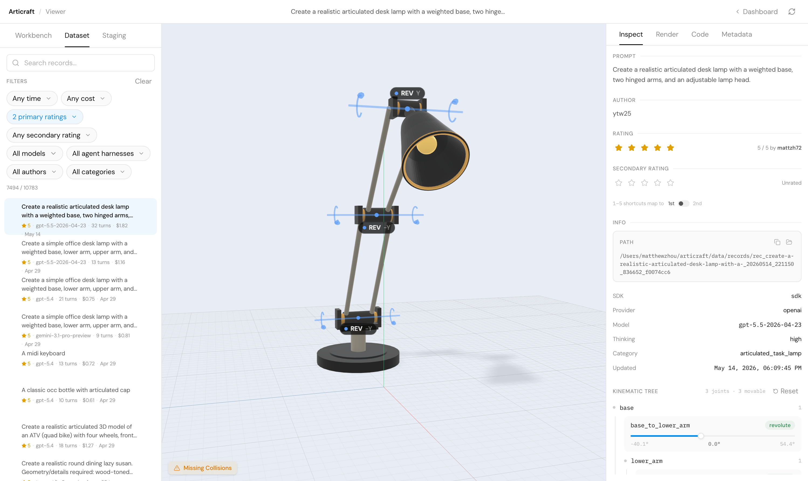

# Articraft

[](LICENSE)
[](https://www.python.org/)
[](https://github.com/mattzh72/articraft/actions/workflows/ci.yml)

**面向可扩展关节化 3D 资产生成的智能体系统。**

[论文](https://arxiv.org/abs/2605.15187) | [项目主页](https://articraft3d.github.io/)

Articraft 将关节化 3D 资产的创建转化为由大语言模型（LLM）驱动的程序化代码生成工作流。系统面向大规模数据集生成而设计，可绕开笨重的手工建模工具，快速产出具有语义部件、稳健几何与物理关节的对象。



> **安全提示：** Articraft 通过在本机执行记录中的 `model.py`（Python 脚本）来编译与检查生成记录。**仅对可信来源**运行生成记录与模型脚本。不可信或对抗性提示生成的代码应在隔离环境（容器、一次性虚拟机等）中处理。详见 [安全策略](SECURITY_c.md)。

---

## 快速入门

本节假设你已在仓库根目录克隆了本仓库，并希望从零生成并浏览第一个资产。

### 1. 前置条件

| 依赖 | 是否必需 | 说明 |
| --- | --- | --- |
| Python 3.12（或 3.11） | 是 | 推荐 3.12；**当前不支持 Python 3.13+**（与 `cadquery`、`vtk` 等轮子约束有关） |
| [`uv`](https://docs.astral.sh/uv/) | 是 | 快速 Python 包与环境管理 |
| [`just`](https://github.com/casey/just) | 是 | 任务运行器（setup、检查、启动查看器等） |
| [`npm`](https://docs.npmjs.com/downloading-and-installing-node-js-and-npm) | 可选但推荐 | 本地 Web 查看器前端需要 |

**常见问题：**

- **`uv` 未找到**：按 [uv 官方文档](https://docs.astral.sh/uv/getting-started/installation/) 安装后重启终端。
- **Python 版本不对**：检查 `python --version`；仓库通过 `.python-version` 倾向 3.12。

### 2. 环境初始化

在仓库根目录执行：

```bash
just setup
```

该命令通常会：同步 Python 依赖、从 `.env.example` 引导 `.env`（不覆盖已有密钥）、安装 pre-commit/pre-push 与托管 post-commit 钩子、在存在 `npm` 时安装查看器前端依赖，并初始化 `data/` 存储树。

### 3. 配置 API 密钥

编辑 `.env`，设置一个或多个提供商密钥，例如：

- `OPENAI_API_KEY` 或 `OPENAI_API_KEYS`
- `GEMINI_API_KEYS`
- `ANTHROPIC_API_KEY` 或 `ANTHROPIC_API_KEYS`
- `OPENROUTER_API_KEY` 或 `OPENROUTER_API_KEYS`

可选：设置 `ARTICRAFT_MAX_COST_USD` 作为单次生成的默认费用上限（美元）。

> **没有 API 密钥？** 可以使用 Claude Code、Codex、Cursor 等**外部 AI 智能体**。将智能体指向本仓库并提示：
>
> *"Create a realistic articulated [object name] and add it to the Articraft dataset. Follow EXTERNAL_AGENT_DATA_c.md."*
>
> 外部智能体应使用 `uv run articraft external ...` 工作流，**不要**手动创建 `data/records/` 目录。详见 [外部智能体数据指南](EXTERNAL_AGENT_DATA_c.md)。

### 4. 生成第一个资产

使用 `articraft generate` 从自然语言提示直接生成：

```bash
uv run articraft generate "Create a realistic articulated desk lamp with a weighted base, two hinged arms, and an adjustable lamp head."
```

**默认行为（未指定覆盖时）：**

- 模型：`gpt-5.4`
- 思考级别：`--thinking-level high`

**自定义模型与费用上限示例：**

```bash
uv run articraft generate --model gemini-3-flash-preview --max-cost-usd 1.5 "Create a compact desk fan with adjustable tilt."
```

生成完成后，记录位于 `data/records/<record_id>/`；可用 `uv run articraft compile data/records/<record_id> --target visual` 为查看器准备可视化资产。

### 5. 打开查看器

浏览刚生成的对象。本地 API（FastAPI）与 React 前端可一键启动：

```bash
just viewer
```

- 默认在 `http://127.0.0.1:8765` 提供服务（会先构建 `viewer/web`）。
- 开发时可用 `just viewer-dev`：Vite 在 `:5173`，API 代理到 `:8765`。

**提示：** 批量浏览前可先运行 `uv run articraft compile-all` 加速可视化材质化。

### 6. 编辑已有资产

在保留父记录不变的前提下修改资产，请使用 **fork（派生）**：

```bash
uv run articraft fork data/records/<record_id> "make the handle longer"
```

Fork 会创建新的子记录，父记录不被修改。模型选项、数据集行为与历史查看见 [编辑已有记录](docs/record_editing_c.md)。

---

## 贡献数据

Articraft 的重要目标之一是通过众包构建多样、大规模的关节化 3D 模型数据集。欢迎通过 CLI、批处理或外部 AI 智能体（如 Claude Code、Codex）贡献生成结果。

完整的数据流水线、生成指南与 Pull Request 流程请参阅 **[CONTRIBUTING_c.md 中的数据贡献工作流](CONTRIBUTING_c.md)**。

**数据使用与许可**

向 Articraft 贡献数据即表示你理解并同意：你的提交将用于构建、评估与改进机器学习模型，并作为公开数据集的一部分分发。你明确同意所有贡献数据在 **[Creative Commons Attribution 4.0 International (CC-BY 4.0)](https://creativecommons.org/licenses/by/4.0/)** 许可下发布。

---

## 文档与进阶用法

| 文档 | 内容概要 |
| --- | --- |
| [架构与项目结构](docs/architecture_c.md) | 模块划分、工作台 vs 数据集、存储布局 |
| [编辑已有记录](docs/record_editing_c.md) | `fork`、谱系、查看器历史 |
| [数据集生成与批处理](docs/dataset_generation_c.md) | CSV 批规格、并发、恢复（resume） |
| [贡献规范与工作流](CONTRIBUTING_c.md) | 开发、PR、数据策展与评级 |
| [安全策略](SECURITY_c.md) | 漏洞报告、不可信 `model.py` |
| [外部智能体数据](EXTERNAL_AGENT_DATA_c.md) | Codex / Claude Code 唯一支持流程 |
| [类别提示指南](data/CATEGORY_PROMPT_GUIDE_c.md) | 批处理 prompt 写作规范 |
| [仓库指南（AGENTS）](AGENTS_c.md) | 面向编码智能体的命令与约定 |
| [Claude Code 指南](CLAUDE_c.md) | 面向 Claude 的扩展命令与架构摘要 |

## 引用

```bibtex
@article{zhou2026articraft,
  title     = {Articraft: An Agentic System for Scalable Articulated 3D Asset Generation},
  author    = {Zhou, Matt and Li, Ruining and Lyu, Xiaoyang and Song, Zhaomou and Huang, Zhening and Zheng, Chuanxia and Rupprecht, Christian and Vedaldi, Andrea and Wu, Shangzhe},
  journal   = {arXiv preprint arXiv:2605.15187},
  year      = {2026}
}
```

本仓库代码在 [Apache-2.0 License](LICENSE) 下许可。
