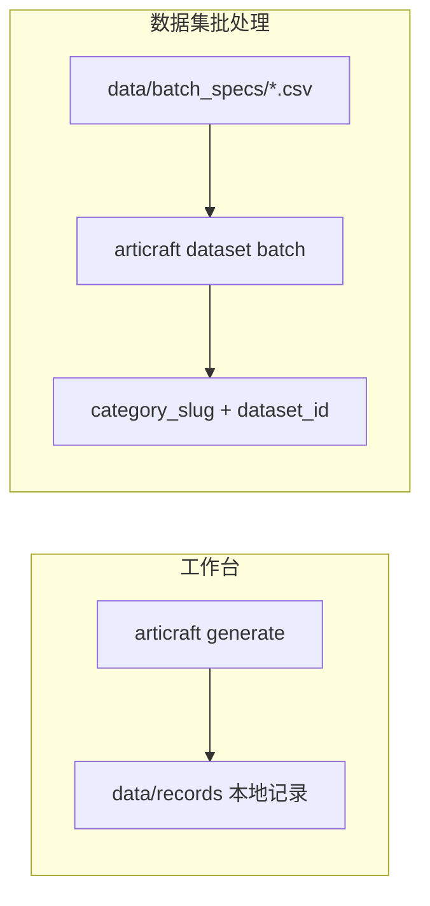

# Articraft 架构与仓库组织

Articraft 面向**可扩展的关节化 3D 资产生成**，核心思路是：通过多轮 LLM 工具循环编写 `model.py`，再编译为 URDF/网格等可检查、可浏览的制品，并在失败时迭代修正——形成「建模—编译—反馈」闭环。

本文说明各顶层目录职责、两种生成模式（工作台 vs 数据集批处理）、依赖约束，以及数据在磁盘上的流向。更细的批处理 CSV 规则见 [数据集生成指南](dataset_generation_c.md)。

---

## 项目结构与模块组织

| 路径 | 职责 | 典型入口/说明 |
| --- | --- | --- |
| **`agent/`** | 生成运行时 | `harness.py` / `single_run.py` 多轮 LLM 循环；`compiler.py` 执行 `model.py` 并导出 URDF/网格；`providers/` 适配 OpenAI、Gemini、Anthropic、OpenRouter；`tools/` 工具 schema；`prompts/` 提示编译与加载；`tui/` 终端展示 |
| **`agent/batch_runner.py`** | 数据集批编排 | 校验 CSV 行、预分配 `dataset_id`/`record_id`、并发执行行、resume 状态、`data/cache/runs/` 缓存 |
| **`storage/`** | 规范 `data/` 布局 | 记录、类别、数据集元数据、批规格、材质化元数据、校验、清单、搜索索引（SQLite） |
| **`sdk/`** & **`sdk/_core/`** | 关节对象 SDK | `sdk/v0/` 为公开导入面；`_core` 共享几何/导出逻辑 |
| **`sdk/_docs/`** & **`sdk/_examples/`** | 智能体创作参考 | 加载进生成上下文；属于「创作契约」，勿在其中重复描述应由 harness 自动完成的工作流 |
| **`viewer/api/`** | FastAPI 服务 | 提供记录与缓存制品 API |
| **`viewer/web/`** | React + TypeScript + Three.js | 可视化检查几何、关节、元数据；Tailwind v4 + shadcn/ui |
| **`cli/`** | `articraft` 命令入口 | `uv run articraft ...` |
| **`tests/`** | pytest 回归 | 镜像主包结构；偏快速冒烟与行为检查 |

---

## 数据集与工作台概念

Articraft 中有两种主要的生成运行方式：

### 1. 工作台（Workbench）

- **命令**：`uv run articraft generate "..."`、`draft`、`fork` 等。
- **用途**：隔离探索、单对象试验、本地草稿。
- **存储**：状态保存在本地 `data/records/`；在归入数据集类别之前，记录通常属于工作台集合，**不会**自动进入某个 `category_slug` 的数据集统计。

### 2. 数据集批处理（Dataset Batches）

- **驱动**：`data/batch_specs/<batch-id>.csv` 中的 CSV 规格。
- **特点**：每行绑定 `category_slug`；支持高并发（`--row-concurrency`）、子进程编译/QC（`--subprocess-concurrency`）、以及完整的 **resume（恢复）** 与分配复用。
- **适用**：大规模、可追踪、可重试的类别批量生成。

详细工作流（创建 CSV、resume 策略、输出路径）见 [数据集生成指南](dataset_generation_c.md)。

---

## 数据流（端到端）

1. **输入**：文本提示和/或参考图进入 `articraft generate`、`dataset run` 或批处理 CSV 的某一行。
2. **生成**：harness 构建提供商特定请求，运行多轮工具循环，写出 `revisions/<revision_id>/model.py`。
3. **编译**：`agent/compiler.py` 在本机执行 `model.py`，导出 URDF、网格及编译报告。
4. **持久化**：规范记录写入 `data/records/<record_id>/`（`record.json`、`revisions/`、`collections/` 等）。
5. **可再生物料**：`data/cache/record_materialization/<record_id>/` 存放 URDF、查看器资产、编译报告等（可 `compile` / `compile-all` 重建）。
6. **浏览**：`viewer/api` 提供 HTTP；`viewer/web` 渲染关节与元数据。

---

## 依赖与环境

| 组件 | 版本/说明 |
| --- | --- |
| **Python** | 本地 `uv` 倾向 **3.12**（`.python-version`）；支持 3.11；**排除 3.13**（`cadquery`、`vtk` 轮子等原因） |
| **前端** | `viewer/web/package.json`：Vite + Three.js；`npm --prefix viewer/web run dev|build|lint|typecheck` |
| **包管理** | Python 用 `uv`；任务快捷方式用 `just` |

**编译与查看器快捷记忆：**

- 浏览前快速可视化：`uv run articraft compile-all`（visual 目标）
- 需要含碰撞的 URDF  bulk：`uv run articraft compile-all --target full`
- 严格几何校验失败即停：加 `--strict`

---

## 存储布局速查

| 路径 | 内容 |
| --- | --- |
| `data/records/<record_id>/` | 规范记录目录 |
| `data/categories/` | 类别元数据 |
| `data/supercategories.json` | 超类分组 |
| `data/batch_specs/` | 批处理 CSV（文件名 stem = `batch_spec_id`） |
| `data/cache/manifests/` | 派生清单 |
| `data/cache/record_materialization/<record_id>/` | URDF、编译报告、查看器资产 |
| `data/cache/runs/<run_id>/` | 批运行结果、分配、失败、resume 状态 |
| `data/cache/search/` | 搜索索引缓存 |

---

## 延伸阅读

- [数据集生成与批处理](dataset_generation_c.md)
- [编辑已有记录](record_editing_c.md)
- [贡献指南](../CONTRIBUTING_c.md)
- [仓库指南（AGENTS）](../AGENTS_c.md)
